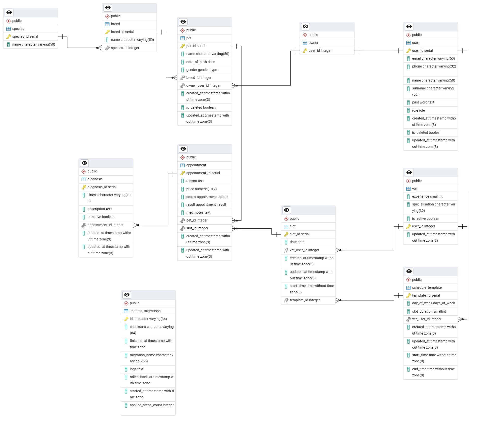

## Схема бази даних

### ER Діаграма



---

#### Таблиця: `user`

**Призначення:** Зберігає інформацію про облікові записи користувачів

**Стовпці:**

| Стовпець | Тип      | Обмеження      | Опис                                                     |
| ---------------- | ----------- | ----------------------- | ------------------------------------------------------------ |
| user_id          | SERIAL      | PRIMARY KEY             | Ідентифікатор користувача            |
| email            | VARCHAR(50) | UNIQUE, NOT NULL        | Email користувача                                 |
| phone            | VARCHAR(32) | UNIQUE                  | Телефон користувача                        |
| name             | VARCHAR(50) | NOT NULL                | Ім'я користувача                               |
| surname          | VARCHAR(50) | NOT NULL                | Прізвище користувача                      |
| password         | TEXT        | NOT NULL                | Хешований пароль                              |
| role             | role        | NOT NULL                | Роль користувача                             |
| created_at       | TIMESTAMP   | DEFAULT NOW(), NOT NULL | Час створення облікового запису  |
| updated_at       | TIMESTAMP   | NOT NULL                | Час оновлення облікового запису |
| is_deleted       | BOOLEAN     | DEFAULT FALSE, NOT NULL | Прапор м'якого видалення                |

**Індекси:**

- `user_pkey` на `user_id` (первинний ключ)
- `user_email_key` - UNIQUE індекс на `email`
- `user_phone_key` - UNIQUE індекс на `phone`

**Зв'язки:**

- Один-до-одного з `owner` та `vet` (користувач може мати тільки одну роль в системі)

---

#### Таблиця: `owner`

**Призначення:** Зберігає інформацію про облікові записи власників

**Стовпці:**

| Стовпець | Тип  | Обмеження                         | Опис                                    |
| ---------------- | ------- | ------------------------------------------ | ------------------------------------------- |
| user_id          | INTEGER | PRIMARY KEY, FOREIGN KEY → user(user_id) | Ідентифікатор власника |

**Індекси:**

- `owner_pkey` на `user_id` (первинний ключ)

**Зв'язки:**

- Один-до-одного з `user` (власник може мати тільки один обліковий запис)
- Один-до-багатьох з `pet` (власник може мати багато улюбленців)

---

#### Таблиця: `species`

**Призначення:** Зберігає інформацію про види тварин

**Стовпці:**

| Стовпець | Тип      | Обмеження | Опис                            |
| ---------------- | ----------- | ------------------ | ----------------------------------- |
| species_id       | SERIAL      | PRIMARY KEY        | Ідентифікатор виду |
| name             | VARCHAR(50) | UNIQUE, NOT NULL   | Назва виду                 |

**Індекси:**

- `species_pkey` на `species_id` (первинний ключ)
- `species_name_key` - UNIQUE індекс на `name`

**Зв'язки:**

- Один-до-багатьох з `breed` (один вид може включати в себе багато порід)

---

#### Таблиця: `breed`

**Призначення:** Зберігає інформацію про породи тварин

**Стовпці:**

| Стовпець | Тип      | Обмеження                 | Опис                                |
| ---------------- | ----------- | ---------------------------------- | --------------------------------------- |
| breed_id         | SERIAL      | PRIMARY KEY                        | Ідентифікатор породи |
| name             | VARCHAR(50) | DEFAULT 'unpedigreed', NOT NULL    | Назва породи                 |
| species_id       | INTEGER     | FOREIGN KEY → species(species_id) | Посилання на вид          |

**Індекси:**

- `breed_pkey` на `breed_id` (первинний ключ)
- `breed_species_id_name_key` на `species_id`, `name` (унікальний складений індекс; запобігає створенню дублікатів назв порід в межах одного виду тварин)

**Зв'язки:**

- Багато-до-одного з `species` (багато порід можуть відноситись до однієї породи)
- Один-до-багатьох з pet (кожна порода може бути у кількох тварин)

---

#### Таблиця: `pet`

**Призначення:** Зберігає інформацію про домашніх улюбленців

**Стовпці:**

| Стовпець | Тип      | Обмеження             | Опис                                            |
| ---------------- | ----------- | ------------------------------ | --------------------------------------------------- |
| pet_id           | SERIAL      | PRIMARY KEY                    | Ідентифікатор тварини           |
| name             | VARCHAR(50) | NOT NULL                       | Ім'я тварини                              |
| date_of_birth    | DATE        | NOT NULL                       | Дата народження тварини        |
| gender           | gender      | NOT NULL                       | Стать тварини                           |
| created_at       | TIMESTAMP   | DEFAULT NOW(), NOT NULL        | Час створення тварини            |
| updated_at       | TIMESTAMP   | NOT NULL                       | Час оновлення даних тварини |
| is_deleted       | BOOLEAN     | DEFAULT FALSE, NOT NULL        | Прапор м'якого видалення       |
| breed_id         | INTEGER     | FOREIGN KEY → breed(breed_id) | Посилання на породу                |
| owner_user_id    | INTEGER     | FOREIGN KEY → owner(user_id)  | Посилання на власника            |

**Індекси:**

- `pet_pkey` на `pet_id` (первинний ключ)
- `pet_breed_id_idx` на `breed_id` (для пришвидшення запитів, що фільтрують або з'єднують тварин за породою)
- `pet_owner_user_id_is_deleted_idx` на `owner_user_id`, `is_deleted` (складений індекс; для швидкого отримання списку активних тварин конкретного власника, ігноруючи видалених)

**Зв'язки:**

- Багато-до-одного з `breed` (декілька тварин можут мати одну й ту саму породу)
- Багато-до-одного з `owner` (декілька улюбленців можуть належати одному власнику/користувачу)
- Один-до багатьох з `appointment` (кожного улюбленця можна записувати на декілька прийомів)

---

#### Таблиця: `vet`

**Призначення:** Зберігає інформацію про облікові записи ветеринарів

**Стовпці:**

| Стовпець | Тип      | Обмеження                         | Опис                                               |
| ---------------- | ----------- | ------------------------------------------ | ------------------------------------------------------ |
| user_id          | INTEGER     | PRIMARY KEY, FOREIGN KEY → user(user_id) | Ідентифікатор ветеринара        |
| experience       | SMALLINT    |                                            | Роки досвіду ветеринара          |
| specialisation   | VARCHAR(32) | NOT NULL                                   | Спеціалізація ветеринара       |
| is_active        | BOOLEAN     | DEFAULT TRUE, NOT NULL                     | Прапор активності ветеринара |
| updated_at       | TIMESTAMP   | DEFAULT NOW(), NOT NULL                    | Час оновлення даних тварини    |

**Індекси:**

- `vet_pkey` на `user_id` (первинний ключ)

**Зв'язки:**

- Один-до-одного з `user` (власник може мати тільки один обліковий запис)
- Один-до-багатьох з `schedule_template` (ветеринар може мати розклад на декілька днів тижня)
- Один-до-багатьох з `slot` (ветеринар може мати багато слотів для запису)

---

#### Таблиця: `schedule_template`

**Призначення:** Зберігає інформацію про графік роботи для кожного ветеринаря

**Стовпці:**

| Стовпець | Тип       | Обмеження          | Опис                                                           |
| ---------------- | ------------ | --------------------------- | ------------------------------------------------------------------ |
| template_id      | SERIAL       | PRIMARY KEY                 | Ідентифікатор графіку                          |
| day_of_week      | days_of_week | NOT NULL                    | День тижня                                                |
| start_time       | TIME         | NOT NULL                    | Час початку роботи на день                   |
| end_time         | TIME         | NOT NULL                    | Час кінця роботи на день                      |
| created_at       | TIMESTAMP    | DEFAULT NOW(), NOT NULL     | Час створення графіку на день тижня  |
| updated_at       | TIMESTAMP    | NOT NULL                    | Час оновлення графіку на день тижня |
| slot_duration    | SMALLINT     | NOT NULL                    | Тривалість слоту на день тижня           |
| vet_user_id      | INTEGER      | FOREIGN KEY → vet(user_id) | Посилання на ветеринара                       |

**Індекси:**

- `schedule_template_pkey` на `template_id` (первинний ключ)
- `schedule_template_vet_user_id_day_of_week_key` на `vet_user_id`, `day_of_week` (унікальний складений індекс; гарантує, що у лікаря є лише один шаблон розкладу на конкретний день тижня)

**Зв'язки:**

- Багато-до-одного з `vet` (декілька графіків можуть належати одному ветеринарю)
- Один-до-багатьох з `slot` (на один день, що має свій графік, може припадати декілька слотів для запису)

---

#### Таблиця: `slot`

**Призначення:** Зберігає інформацію про слоти для прийому до ветеринаря

**Стовпці:**

| Стовпець | Тип    | Обмеження          | Опис                                     |
| ---------------- | --------- | --------------------------- | -------------------------------------------- |
| slot_id          | SERIAL    | PRIMARY KEY                 | Ідентифікатор слоту        |
| date             | DATE      | NOT NULL                    | Дата слоту                         |
| start_time       | TIME      | NOT NULL                    | Час початку слоту            |
| created_at       | TIMESTAMP | DEFAULT NOW(), NOT NULL     | Час створення слоту         |
| updated_at       | TIMESTAMP | NOT NULL                    | Час оновлення слоту         |
| vet_user_id      | INTEGER   | FOREIGN KEY → vet(user_id) | Посилання на ветеринара |

**Індекси:**

- `slot_pkey` на `slot_id` (первинний ключ)
- `slot_vet_user_id_date_start_time_key` на `vet_user_id`, `date`, `start_time` (унікальний складений індекс; запобігає створенню двох слотів на один і той же час для одного лікаря - захист від "double booking")
- `slot_vet_user_id_date_idx` на `vet_user_id`, `date` (складений індекс; для швидкого відображення розкладу лікаря на конкретну дату)
- `slot_vet_user_id_idx` на `vet_user_id` (для швидкого пошуку всіх слотів конкретного ветеринара)

**Зв'язки:**

- Багато-до-одного з `vet` (декілька слотів можуть належати одному й тамому самому ветеринару)
- Багато-до-одного з `schedule_template` (декілька слотів можуть належати одному й тамому самому графіку прийому)
- Один-до-одного з `appointment` (на один слот може бути записаний тільки один прийом)

---

#### Таблиця: `appointment`

**Призначення:** Зберігає інформацію про прийом

**Стовпці:**

| Стовпець | Тип             | Обмеження                   | Опис                                   |
| ---------------- | ------------------ | ------------------------------------ | ------------------------------------------ |
| appointment_id   | SERIAL             | PRIMARY KEY                          | Ідентифікатор прийому  |
| reason           | TEXT               |                                      | Причина прийому             |
| price            | DECIMAL(10, 2)     | DEFAULT 200, NOT NULL                | Ціна за прийом                 |
| status           | appointment_status | NOT NULL                             | Статус прийому               |
| result           | appointment_result |                                      | Результат прийому         |
| med_notes        | TEXT               |                                      | Нотатки лікаря                |
| created_at       | TIMESTAMP          | DEFAULT NOW(), NOT NULL              | Час створення прийому   |
| updated_at       | TIMESTAMP          | NOT NULL                             | Час оновлення прийому   |
| pet_id           | INTEGER            | FOREIGN KEY → pet(pet_id)           | Посилання на улюбленця |
| slot_id          | INTEGER            | UNIQUE, FOREIGN KEY → slot(slot_id) | Посилання на слот           |

**Індекси:**

- `appointment_pkey` на `appointment_id` (первинний ключ)
- `appointment_slot_id_key` на `slot_id` (унікальний індекс; гарантує, що один слот розкладу прив'язаний лише до одного прийому)
- `appointment_pet_id_created_at_idx` на `pet_id`, `created_at` (складений індекс; для швидкого пошуку історії візитів конкретної тварини, відсортованих за часом)
- `appointment_status_idx` на `status` (для фільтрації записів за статусом, наприклад, знайти всі "заплановані" або "завершені" прийоми)

**Зв'язки:**

- Багато-до-одного з `pet` (декілька прийомів можуть належати одному улюбленцю)
- Один-до-одного з `slot` (кожен прийом закриплений за одним слотом ветеринара)
- Один-до-багатьох з `diagnosis` (за результатами одного прийому може виявитись декілька діагнозів)

---

#### Таблиця: `diagnosis`

**Призначення:** Зберігає інформацію про діагнози тварин

**Стовпці:**

| Стовпець | Тип       | Обмеження                         | Опис                                                     |
| ---------------- | ------------ | ------------------------------------------ | ------------------------------------------------------------ |
| diagnosis_id     | SERIAL       | PRIMARY KEY                                | Ідентифікатор діагнозу                  |
| illness          | VARCHAR(100) | NOT NULL                                   | Назва хвороби                                    |
| description      | TEXT         | NOT NULL                                   | Опис діагнозу                                    |
| is_active        | BOOLEAN      | NOT NULL                                   | Прапор активності хвороби             |
| created_at       | TIMESTAMP    | DEFAULT NOW(), NOT NULL                    | Час створення запису про діагноз |
| updated_at       | TIMESTAMP    | NOT NULL                                   | Час оновлення запису про діагноз |
| appointment_id   | INTEGER      | FOREIGN KEY → appointment(appointment_id) | Посилання на прийом                         |

**Індекси:**

- `diagnosis_pkey` на `diagnosis_id` (первинний ключ)
- `diagnosis_appointment_id_illness_key` на `appointment_id`, `illness` (унікальний складений індекс; запобігає дублюванню того самого діагнозу в межах одного прийому)

**Зв'язки:**

- Багато-до-одного з `appointment` (декілька діагнозів можут бути пов'язані з одним й тим самим прийомом)

---

#### Enumerations

```
enum appointment_result {
  healthy
  diagnosed
  recovered
}

enum appointment_status {
  scheduled
  in_progress @map("in progress")
  completed
}

enum days_of_week {
  monday
  tuesday
  wednesday
  thursday
  friday
  saturday
  sunday
}

enum gender_type {
  male
  female
}

enum role {
  owner
  vet
  admin
}
```

---

### Рішення щодо дизайну

#### Структура схеми

Наш проєкт побудований на основі ветеринарної клініки, а саме backend частини сайту для створення прийомів з урахуванням ветеринарів та вільних слотів для запису, тварин і їх власників. Ця структура поєднує в собі всі необхідні сутності, а саме живі істоти (`vet`, `owner`, що об'єднуються в `user` для зручності авторизації/автентифікації; `pet`, що посилається на породу `breed`, яка посилається на вид `species`), які безпосередньо пов'язані з записом на прийом `appointment`, який залежить від слотів slot, а ті в свою чергу від розкладу `schedule_template` вище згаданого ветеринара. А `appointment `може мати як негативний результат діагнози `diagnosis`. Тому саме ця схема використовує найлогічнішу та відповідно вичерпну структуру для проєкту реалізації ветеринарної клініки.

#### Нормалізація

Майже кожна з сутностей відповідає вимогам 3 нормальної форми. Лише в сутності `slot` є надлишкове поле `vet_user_id`, яке є FK, що посилається безпосередньо на таблицю `vet`. Суть у тому, що в сутності `slot` уже є поле `template_id`, яке посилається на таблицю `schedule_template`, а та в свою чергу має поле `vet_user_id`, яке також як FK посилається на таблицю `vet`. Тому можна сказати, що `vet_user_id` залежить від `template_id`, який залежить від PK `slot_id`що порушує вимоги 3 нормальної форми, а саме

> "Відсутні транзитивні залежності - жоден з неключових атрибутів не залежить від іншого неключового атрибуту"

Проте підставою до такого рішення стала денормалізація, а саме швидший пошук ветеринара зі слоту: не потрібно при пошуку ветеринара, який проводив прийом, іти до слоту, потім до розкладу, а лише потім до ветеринара - таблицю розкладу можна оминути, що позитивно вплине на швидкість.

До того ж у разі видалення поля vet_user_id саме з таблиці `slot` ми втратимо індекс `@@unique([vet_user_id, date, start_time])`, який унеможливлює створення слотів на однаковий час і дату до одного ветеринара, що є ключовим у нашій системі.

Водночас ми відмовилися від НЕзалежності слоту та розкладу, оскільки без цього неможливо зробити запит, який одночасно створить цей розклад, а на його основі - слоти.
